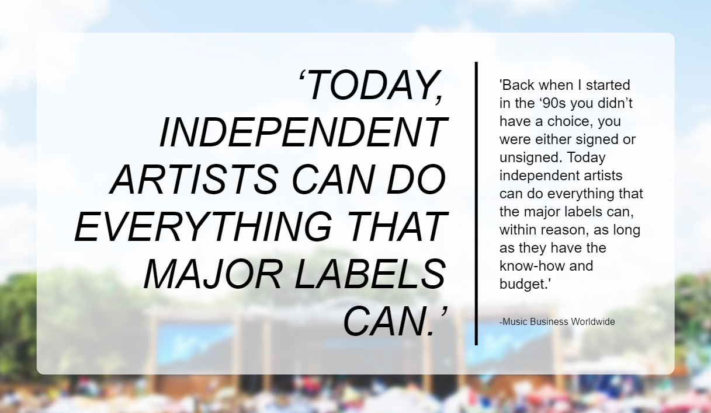
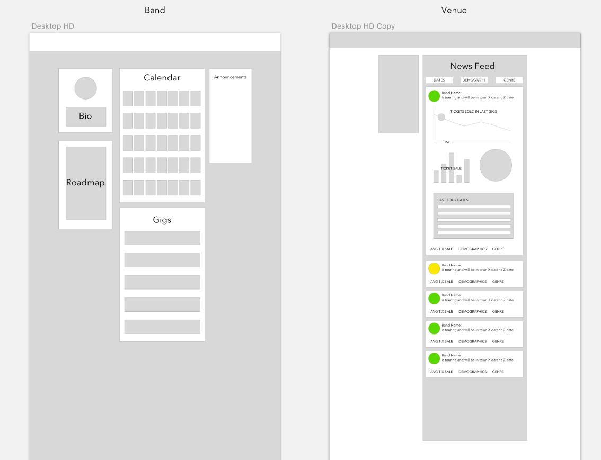
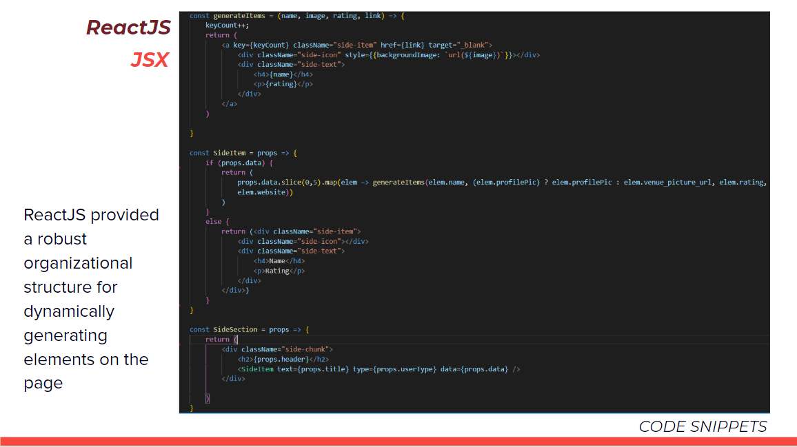
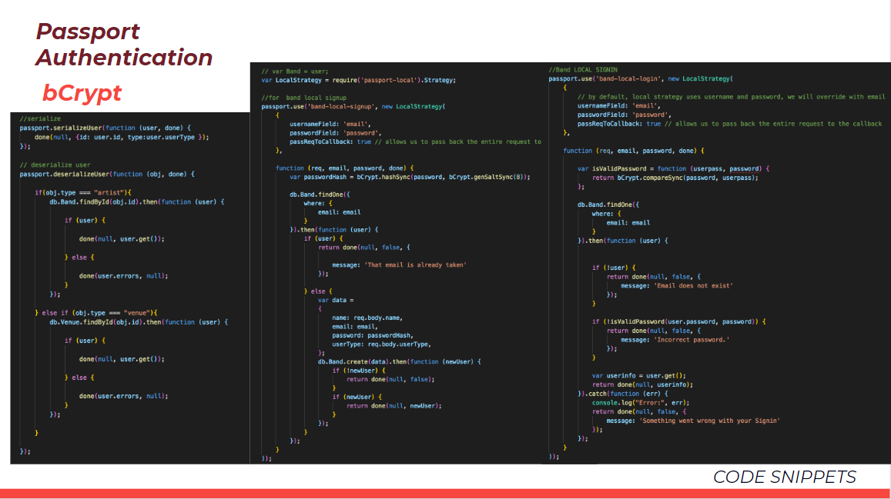

# [](tempomusic.herokuapp.com)

Tempo is a virtual booking agent that allows musicians to stay independent by mitigating the friction in the booking and gigging industry.

* This is a Full-Stack Application powered by React.js, SQL, express.js, and node.js. It follows a MVC framework with a RESTful API architecture. Additional technologies listed below!

*We are currently under construction. Stay tuned for exciting updates!*

# Motivations and Mission



Our mission is to provide an outlet that allows independent artists to progress their careers by booking shows, connecting with like-minded artists, and telling genuine and authentic stories.

## Getting Started

Follow the deployed project link below to utilize the application.

### Deployed Project Link
<!-- make a link to the deployed site -->
 
See what we've got! [Tempo](tempomusic.herokuapp.com)

### Prerequisites

The page can be run from any browser, preferably on Google Chrome!

### Preview of Tempo
<!-- take a picture of the image and add it into the readme  -->
[](tempomusic.herokuapp.com)


## Technologies Used

### Frontend Web Technologies
* [**React**](https://reactjs.org/) - Facebook-developed Javascript library for user interface (UI) development
* [**React Router**](https://reacttraining.com/react-router/) - navigational component library for synchronizing the UI with the URL
* **HTML5**
* **CSS3** - Unique, customized design and FlexBox
* **Javascript** - the primary scripting logic enabling our application
* [**Bideo.js**](https://github.com/rishabhp/bideo.js?utm_source=hashnode.com) - responsive video implementation

### Design Technologies
* Sketch App - detailed mockups
* Adobe Illustrator - icon design
* Adobe Photoshop - logo development
* Pexels - high-definition stock photos and videos

### Yarn Packages

#### Yarn - Javascript package manager to support React JS frameworks
1. [Material UI](https://material-ui.com/) - powerful design framework based on [Google's](https://google.com) Material Design principles
2. Axios - promise based HTTP client for the browser and node.js. Also implemented in the backend
3. React Reveal - animations
4. React Scroll To Component - scrolling functionality
5. React Chart JS - React-specific implementation of [Chart.js](), a well-developed graphing and charting infrastructure for Javascript
6. React Calendar - Calendar implementation


### Backend Technologies and Critical Node Packages

#### Node.js - versatile Javascript runtime 
1. **Express.js** - backend server routing framework
```require("express");```
2. **MySQL2** - server-side relational database 
```require("mysql2");```
3. **Sequelize.js** - object-relational mapping (ORM) for SQL
```require("sequelize");```
4. **Passport.js** - local-strategy login authentication
```require("passport");```
5. **Express Session** - 
```require("express-session");```
6. **Bcrypt** - two-sided hash encrypting
7. **Axios** - promise based HTTP client for the browser and node.js. A more robust option than the *request* npm package
```require("axios");```
8. **Body Parser** - middleware technology for JSON formatting
``` require("body-parser"); ```
9. **Cookie Parser** - middleware parsing for cookies for headers and secrets
``` require("cookie-parser"); ```
10. **Path** - simplifies directories and filepaths through Node
``` require("path"); ```
11. **Morgan** - logging middleware for node.js HTTP apps
``` require("morgan"); `

# Design History 

### Initial Mockups and Wireframe

We initially designed a rough wireframe outlining the core functionality of the application for our two principal user models. And artist or band would be able to log-in and see their calendar, local gigs that they can book, and relevant announcements. A venue would be able to see top bands and artists in their area with their relevant statistics. 


*Design Stage One*

### Final Design 


# Code Snippets
<!-- put snippets of code inside ``` ``` so it will look like code -->
<!-- if you want to put blockquotes use a > -->

ReactJS provides a unique component-based architecture that allowed for precise development of our user interface. Here is a more digestible implementation of React that allowed for dynamic rendering of pertinent information on a `SideSection` component. The component absorbs properties from a higher level component and sends those properties to a lower component, `SideItem`, which renders numerous pertinent pieces of information for the user, depending on the goals of the page on which it renders. This dependant data is defined in the *data* prop which is passed to `SideSection` and then to `SideItem` and then finally to the `generateItems` function that renders the first five relevant elements in the data in the structure that is required, using JSX.


#
Explanation Chunk



#
Explanation Chunk


# Learning Points and Future Goals
<!-- Learning points where you would write what you thought was helpful -->
* Employ Redux for more effective state management 
* Implement Socket.io for internal communication 
* Establish a nodemailer system
* Further public profile functionality
* Develop a powerful rating system between bands and venues

## Core Developers

* **Andrew Ton** - [GitHub](https://github.com/atton88)
* **Kevin Macaraeg** - [GitHub](https://github.com/NasibNia)
* **Nasibeh Nourbakshnia** - [GitHub](https://github.com/everysf)
* **Sajeel Malik** - [GitHub](https://github.com/sajeelmalik)

### Task Breakdown

| Task                                                                     | Lead                        |
|--------------------------------------------------------------------------|-----------------------------|
| Research, Logic and Execution                                    | Andrew, Nasib, Kevin, Sajeel |
| *Innovative Design*                                                  | Kevin, Sajeel                |
| *ReactJS Implementation* Success Team                                             | Sajeel, Kevin                |
| *Authentication* and Passport Execution                                         | Nasib, Andrew                     |
| *Database and Model* Management with SQL and Sequelize                                             | Nasib, Andrew                       |
| *Routing and Controller* Establishment                                         | Andrew, Nasib                      |


## License

This project is licensed under the MIT License - see the [LICENSE.md](LICENSE.md) file for details